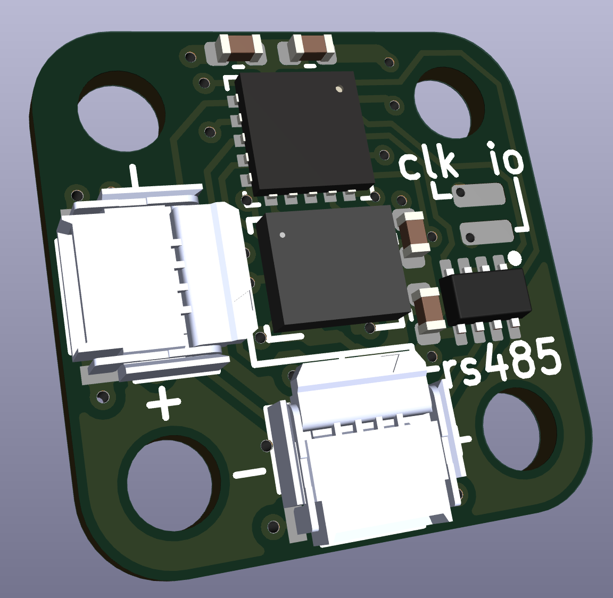

## Compact 6DOF sensor fusion IMU for RS485 bus

Intended to work with [squirrelbrain](https://github.com/qwertpas/squirrelbrain) as part of the [Pintobotics](https://pintobotics.substack.com) project.

IMU: [LSM6DSV](https://www.st.com/en/mems-and-sensors/lsm6dsv.html)

MCU: [STM32L011F4U](https://www.digikey.com/en/products/detail/stmicroelectronics/STM32L011F4U6TR/6166960)

Size: 12.5mm x 12.5mm

Mounting: 4x M2 on 12mm diameter circle 

Connection: 2x 4pin 0.5mm pitch FFC for power and RS485 communication (daisy chainable)

Alternate connection: I2C and interrupt solder pads, aux GPIO/ADC

